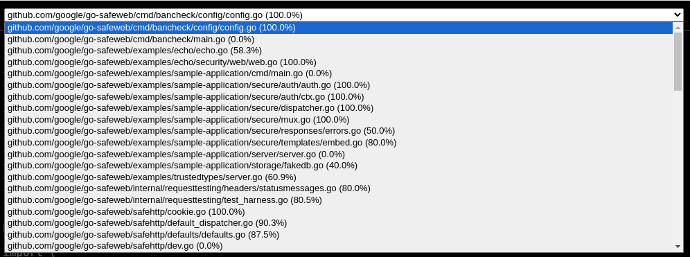
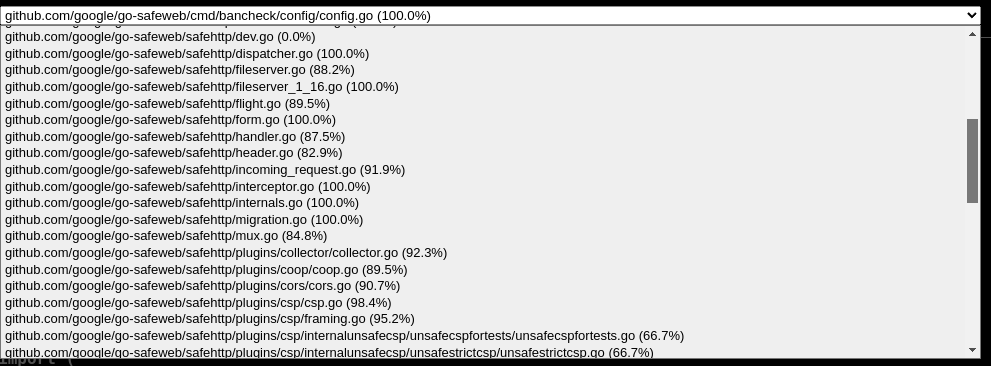
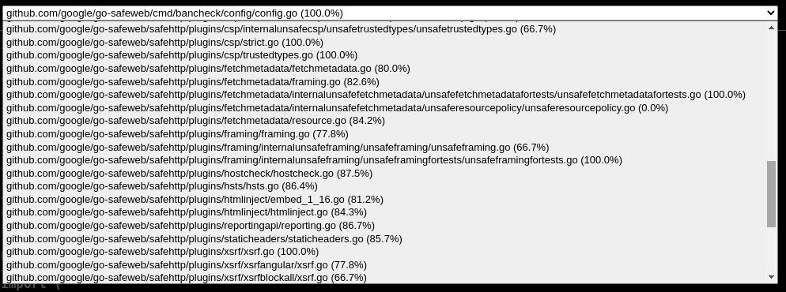
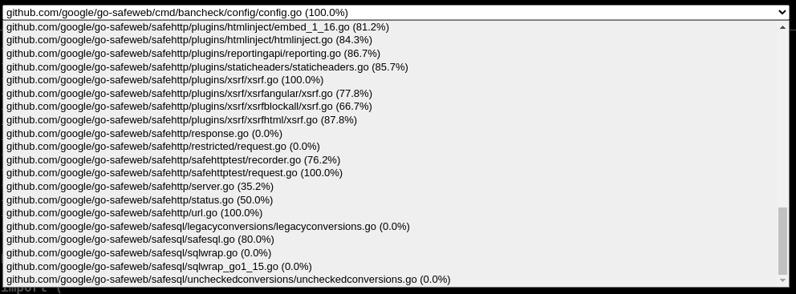
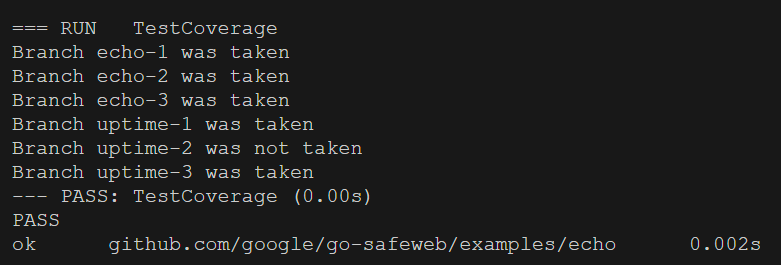

# Report for Assignment 1

## Project chosen

Name: go-safeweb

URL: [<TODO>](https://github.com/google/go-safeweb)

Number of lines of code and the tool used to count it: 13k https://github.com/AlDanial/cloc

Programming language: go

## Coverage measurement

### Existing tool

go cover
https://pkg.go.dev/cmd/cover

<Show the coverage results provided by the existing tool with a screenshot>
run the tests and save the coverage data in 'coverage.out'
<code>go test -coverprofile coverage.out ./...</code>
use the cover tool to get a nice visual display:
<code>go tool cover -html=coverage.out</code>

### Your own coverage tool

<The following is supposed to be repeated for each group member>

<Group member name>
Berat Kir

Function 1: echo
Function 2: uptime

## Coverage improvement

### Individual tests

<The following is supposed to be repeated for each group member>

<Group member name>

<Test 1>

<Show a patch (diff) or a link to a commit made in your forked repository that shows the new/enhanced test>

<Provide a screenshot of the old coverage results (the same as you already showed above)>

<Provide a screenshot of the new coverage results>

<State the coverage improvement with a number and elaborate on why the coverage is improved>

<Test 2>

<Provide the same kind of information provided for Test 1>

### Overall

<Provide a screenshot of the old coverage results by running an existing tool (the same as you already showed above)>

<Provide a screenshot of the new coverage results by running the existing tool using all test modifications made by the group>

## Statement of individual contributions

<Write what each group member did>
