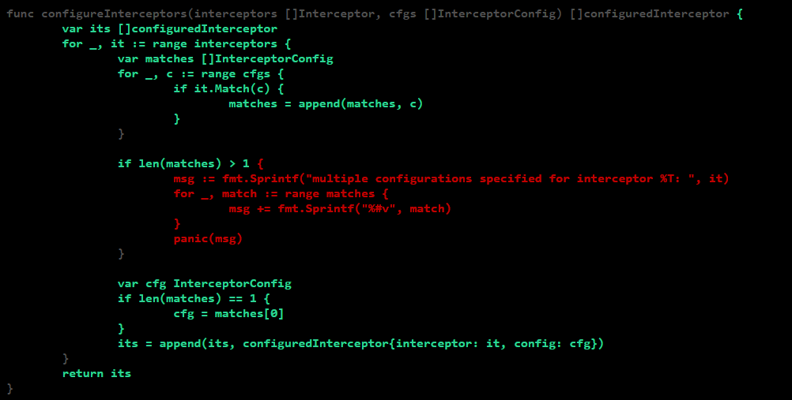

# Report for Assignment 1

## Project chosen

Name: go-safeweb

URL: [go-safeweb](https://github.com/google/go-safeweb)

Number of lines of code and the tool used to count it: 13k LOC https://github.com/AlDanial/cloc

Programming language: go

## Coverage measurement

### Existing tool

go cover
https://pkg.go.dev/cmd/cover

<Show the coverage results provided by the existing tool with a screenshot>
run the tests and save the coverage data in 'coverage.out'
<code>go test -coverprofile coverage.out ./...</code>
use the cover tool to get a nice visual display:
<code>go tool cover -html=coverage.out</code>

### Your own coverage tool

<The following is supposed to be repeated for each group member>

Group member name: Nika Emadian

Function 1 name: SameSite

Function 2 name: Write

[GitHub Commit](https://github.com/dr-noid/go-safeweb/commit/5fb77332308d05571fa3160aff046c01725fd559)

Group Member: Berat Kir

Function 1: echo

Function 2: uptime

[GitHub Commit](https://github.com/dr-noid/go-safeweb/commit/b071a38bd809d8afcf3be28dace3da369f5fe4c2)

Group Member: Timur Kaya

Function 1: Write

Function 2: writeError

[GitHub Commit](https://github.com/google/go-safeweb/commit/473f0affd91ffc7d3bee41f013ea0035eb278c2f)

Group Member: Maarten Mostert

Function 1: StripPrefix

Function 2: addCookie

[GitHub Commit](https://github.com/google/go-safeweb/commit/0d506aa43c9b286633f22733cf9a0753a93dc42b)

## Coverage improvement

### Individual tests

<The following is supposed to be repeated for each group member>

Test 1 & 2: TestWriteJSON & TestRedirect

Group Member: Berat Kir

[GitHub Commit](https://github.com/google/go-safeweb/commit/45bb361abd32d9137efe2f9fae028270023f7160)

Old Coverage

New Coverage

The coverage for the `response.go` file was 0% at first and I increased the coverage to 50%, making sure to cover
the two most used functions.

Group Member: Timur Kaya

[GitHub Commit](https://github.com/google/go-safeweb/commit/a9f91c7f0f1d010cf97ea9804a124aa8b276105e)

Test 1: configureInterceptors

Old Coverage

New Coverage

Test 2: Close

Old Coverage

New Coverage

For the coverage measurement I set a flag if a branch was taken for the functions write and writeError, to see which branches were taken.
Then I improved coverage for the functions configureInterceptors() in the Mux file, and close() in the Server file, improving the coverage from 84.8% to 93.5% and 35.2% to 37% respectively.

Group Member: Nika Emadian

[GitHub Commit](https://github.com/dr-noid/go-safeweb/commit/f6282ab0412c6747d8c4a37d0544d946e2dceeed)

Test 1: TestFlightValueNil

Old Coverage

New Coverage

Test 2: TestFlightAddCookie

Old Coverage

New Coverage

flight.go had a coverage of 89.5% initially, while by testing FlightValues it was increased to 92.1%.
By testing the second function the coverage increased from 92.1% to 94.7%.

Group Member: Maarten Mostert

[GitHub Commit](https://github.com/google/go-safeweb/commit/0d506aa43c9b286633f22733cf9a0753a93dc42b)

Test 1: TestStripPrefixEmpty

Old Coverage

New Coverage

Test 2: AddCookie

Old Coverage

New Coverage

The coverage for header.go went from 82.9% to 95.3%, and the coverage for handler.go went from 87.5% to a full 100%.

### Overall

Old Coverage

New Coverage

## Statement of individual contributions

<Write what each group member did>
